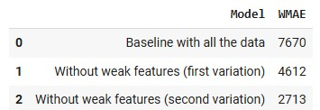
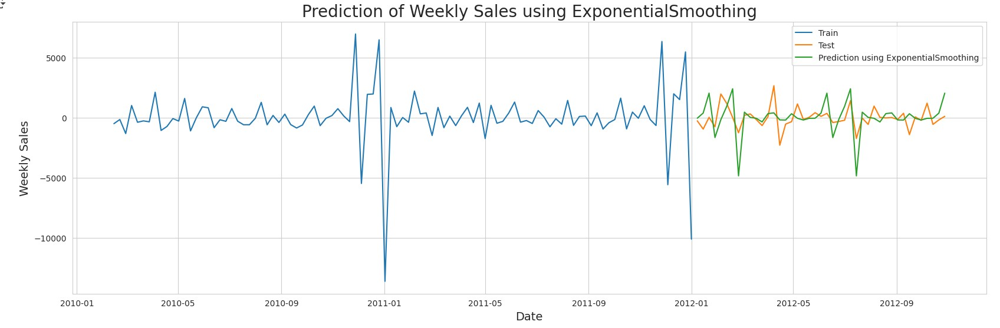

# Walmart Sales Prediction Model


# Summary
This project involves implementing a weekly sales forecasting model for Walmart, focusing on the impact of major U.S. national holidays. The goal is to predict sales fluctuations during these periods by incorporating historical sales data and holiday effects. Machine learning and statistical techniques will be used to enhance forecasting accuracy.

# Key Insights
1. In the graph below, I present the weekly sales average during holidays, broken down by store type. Type A has the highest sales average, followed by Type B, and then Type C. Thanksgiving stands out as the holiday with the highest sales average across all store types:


2. In this graph, we can observe that Store Type A, with the largest physical space, leads in sales volume, followed by Store Type B and, lastly, Store Type C. This larger space could be one of the factors contributing to the higher sales volume in Store Type A:


3. In the graph below, we can see the average weekly sales for each year. A similar pattern is observed across the three years analyzed, indicating the presence of seasonality in sales:


4. Here, I generate a correlation matrix of the dataset’s features to analyze the relationships between variables before applying machine learning:


5. Here, I calculate the WMAE, which stands for Weighted Mean Absolute Error. It’s an evaluation metric used to measure the accuracy of predictions while assigning more weight to certain errors. In this case, likely the errors during holidays or peak periods. I tested three different models and compared their WMAE values. The third model achieved the best performance, as it had the lowest WMAE:


6. In this graph, I can more clearly observe the seasonality captured by my model:


7. In this final graph, I show the results after implementing Exponential Smoothing, which ultimately gave me a WMAE of 841. It's important to note that before applying this model, the WMAE was 2713, indicating that Exponential Smoothing was effective in capturing both the trends and seasonal patterns in the data. This significant improvement suggests that the model was able to better adjust for fluctuations and variations, resulting in much more accurate and reliable forecasts:


# Conclusion
This project demonstrates the effectiveness of using machine learning and statistical techniques to forecast weekly sales, especially during periods impacted by major U.S. holidays. By exploring the dataset's patterns and leveraging models such as Exponential Smoothing, I was able to significantly reduce the forecasting error, from a WMAE of 2713 to just 841. The analysis confirmed the strong presence of seasonality in Walmart’s sales and highlighted how store type and physical size influence performance. These insights can support more strategic decision-making in areas like inventory management, staffing, and promotional planning. Overall, this study reinforces the importance of data-driven approaches for improving retail sales forecasting accuracy.

# Technologies Used
- Python
- Pandas
- NumPy
- Matplotlib
- Seaborn
- Jupyter Notebook
- Scikit-learn
- Statsmodels

# How to Run

1. Clone the repository:
   ```bash
   git clone https://github.com/felipe-lemos-costa/Walmart_Sales_Prediction_Model.git
   ```

2. Install dependencies:
   ```bash
   pip install -r requirements.txt
   ```

3. Open and run the Jupyter Notebook:
   ```bash
   jupyter notebook Walmart_Sales_Prediction_Model.ipynb
   ```

# License
This project is licensed under the MIT License - see the [LICENSE](LICENSE) file for details.
